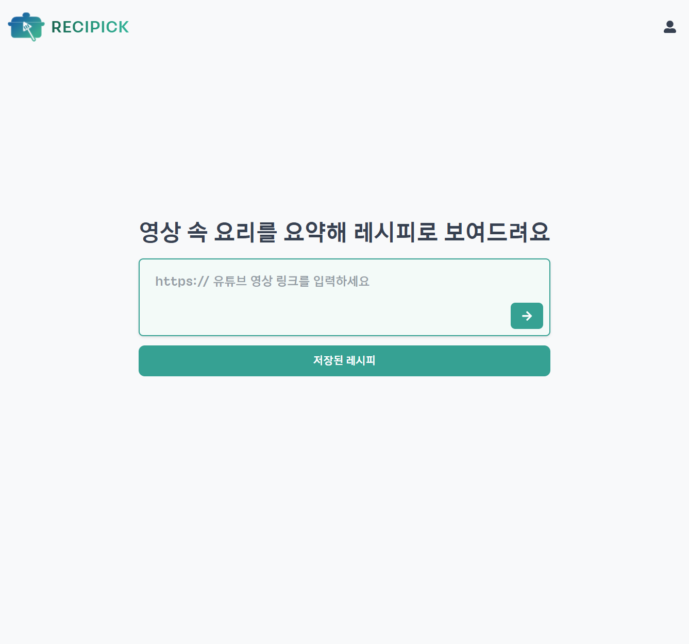
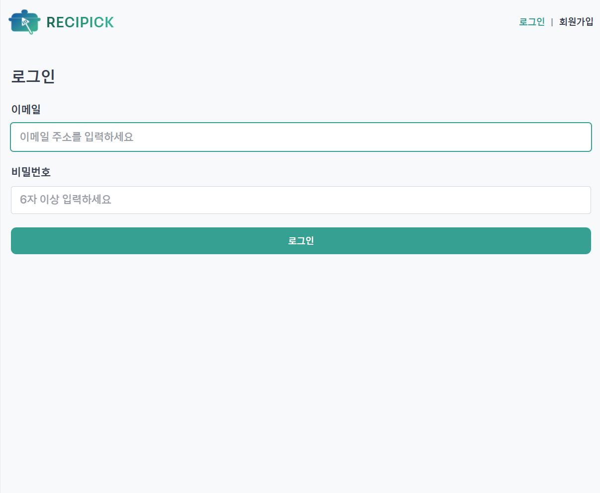
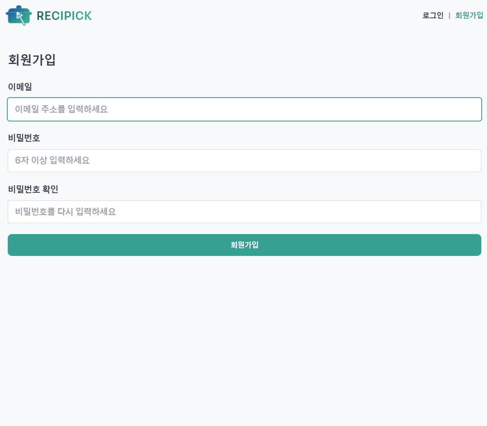
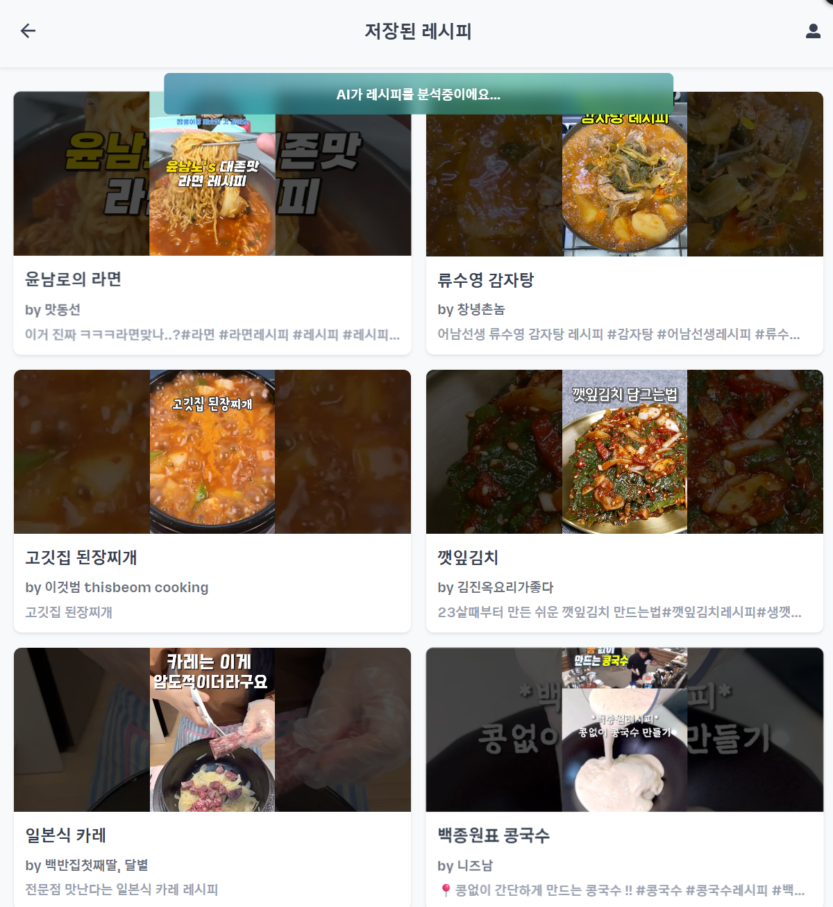
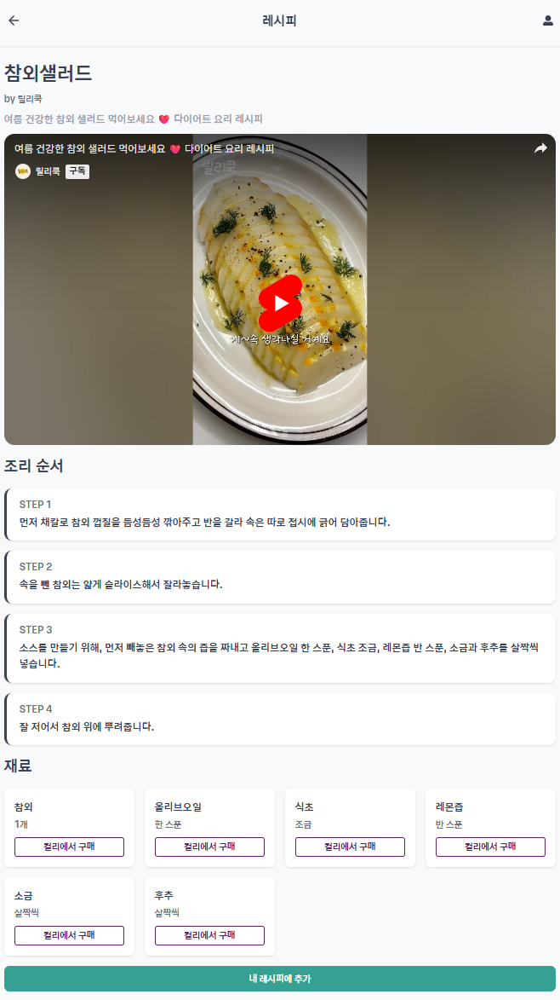
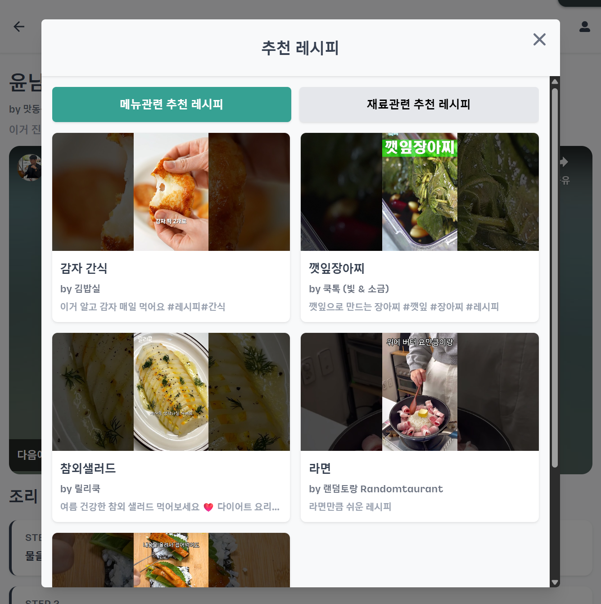
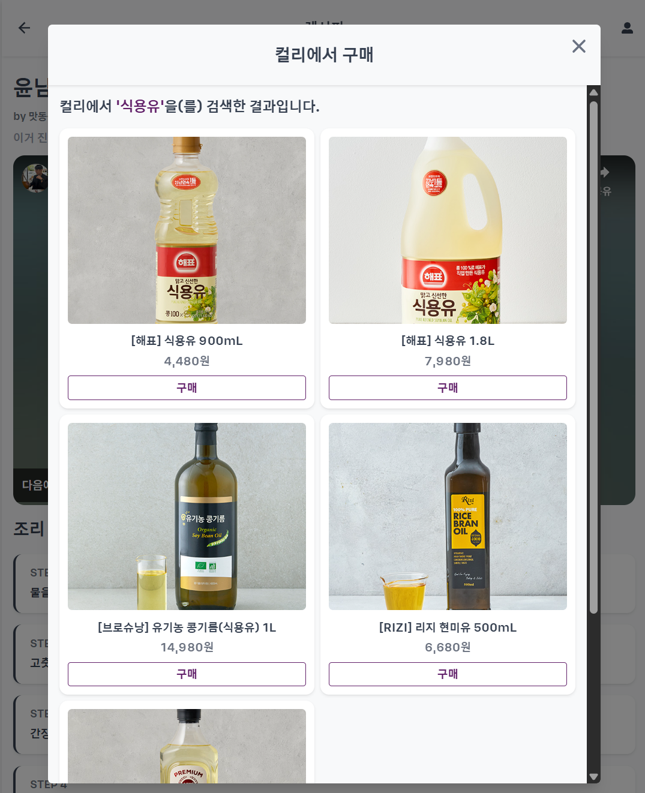

# Recipick (레시픽)

🔗 **배포 링크**: [https://dn-recipick.github.io/](https://dn-recipick.github.io/)

> 유튜브 속 요리를 현실로 옮기는 가장 빠른 방법 **레시픽**

## 🌟 소개

**Recipick**은 유튜브 영상 및 Shorts에서 요리 레시피를 추출하고 관리할 수 있는 웹 애플리케이션입니다.

🧑‍💻 본 프로젝트는 4인 팀으로 개발되었으며,  
이 리포지토리는 [DN-Recipick](https://github.com/orgs/DN-Recipick/repositories)로부터 포크되어,  
**프론트엔드 전반을 단독으로 구현한 코드**를 포함하고 있습니다.

## 🚀 주요 기능

- 🔗 유튜브 링크 입력을 통한 레시피 등록
- 🧠 영상에서 레시피 재료 및 조리 순서를 자동 분석해 제공
- ⏳ 분석 중 실시간 오버레이로 상태 피드백 제공
- 📚 내가 등록한 레시피 목록 확인
- 📄 영상, 재료, 절차가 포함된 레시피 상세 정보 제공
- 📌 메뉴/재료 유사도 기반 추천 레시피 확인 및 상세 페이지 이동
- 🛒 마켓컬리 API 연동으로 재료 구매 링크 제공
- 🔐 로그인 / 회원가입 및 유효성 검사 처리

## 🛠 기술 스택

| 항목        | 내용                                                     |
| ----------- | -------------------------------------------------------- |
| 프레임워크  | React 19 (Vite + TypeScript)                             |
| 상태 관리   | Zustand, React Query (TanStack v5)                       |
| 폼 관리     | React Hook Form + Zod + @hookform/resolvers              |
| API 연동    | Supabase (`@supabase/supabase-js`), Custom Fetch Wrapper |
| 라우팅      | React Router v7                                          |
| 에러 핸들링 | react-error-boundary                                     |
| UI 스타일링 | Tailwind CSS, clsx, react-icons                          |
| 알림 토스트 | react-toastify                                           |

## 📁 디렉토리 구조

```bash
src/
├── assets/ # 이미지, 아이콘 등의 정적 파일
├── components/ # 공통 UI 컴포넌트
│ ├── feedback/ # 로딩, 스켈레톤 등 피드백 요소
│ ├── hooks/ # 컴포넌트 전용 훅
│ ├── layout/ # Header, Footer 등 레이아웃 관련
│ └── ui/ # 버튼 등 단순 UI 요소
├── constants/ # 라우트, 메시지, 쿼리키 등의 상수 정의
├── features/ # 도메인별 기능 폴더
│ ├── addRecipe/ # 레시피 추가 관련 로직
│ ├── auth/ # 로그인, 회원가입 등 인증 기능
│ ├── recipeDetail/ # 레시피 상세 조회 기능
│ └── recipes/ # 레시피 리스트 관련 기능
├── hooks/ # 전역 커스텀 훅
├── lib/ # Supabase 클라이언트, queryClient 등
├── pages/ # 라우팅 대상 페이지 컴포넌트
├── store/ # Zustand 상태 관리
├── styles/ # 전역 스타일, Tailwind 설정 등
├── types/ # 전역 타입 정의
├── utils/ # 유틸 함수 모음
├── validation/ # Zod 유효성 검사 스키마
├── App.tsx # 라우터 및 레이아웃 엔트리
├── main.tsx
```

## 🖥 화면 구성

### 🏠 홈 화면

> 유튜브 링크를 입력해 레시피를 등록할 수 있는 진입 페이지

<div align="center">
  
</div>

---

### 🔐 인증 화면

> Supabase 기반 로그인 / 회원가입 기능을 제공하며, 이메일/비밀번호 입력 및 유효성 검사를 포함

<div align="center">
  
  
</div>

---

### ⏳ 레시피 목록

> 저장된 레시피 목록 화면, AI(서버)가 레시피를 분석 중일 때 오버레이를 통한 시각적 피드백 제공

<div align="center">
  
</div>

---

### 📄 레시피 상세 화면

> 조리과정 및 재료, 유튜브 영상 iframe 제공, 내가 저장한 레시피 -> 추천레시피 모달 여는 기능 아니면 내 레시피 추가 기능

<div align="center">
  
</div>

---

### 🧠 추천 레시피 모달

> 유사한 재료/메뉴 기반으로 레시피 추천을 제공 및 카드 클릭시 해당 레시피 상세로 이동

<div align="center">
  
</div>

---

### 🛒 레시피 재료 컬리 링크 모달

> 재료관련 마켓컬리 베스트 5 상품판매 링크 제공

<div align="center">
  
</div>

## 🧑‍💻 개발 상세

- **데이터 캐싱 및 비동기 처리**  
  React Query v5의 `useQuery`, `useMutation`, `invalidateQueries`를 활용해 API 캐싱 및 오류 처리  
  기능별로 요청 함수를 분리하고 공통 로직을 추상화하여 API 호출 흐름을 일관성 있게 관리  
  AI 분석 후 반환되는 데이터를 스켈레톤 UI와 연결해 사용자 경험을 부드럽게 구성

- **API 모듈 분리 및 fetch wrapper 설계**  
  Supabase 클라이언트와 별도로 fetch 기반 API 요청 유틸을 구성  
  공통 헤더, 오류 처리, 타임아웃 등을 중앙 집중화하여 관리

- **컴포넌트 구조 설계**  
  기능 단위(`features/`)로 디렉토리를 구성하여 도메인 책임을 명확히 구분  
  기능 단위로 컴포넌트를 구성해 도메인 책임을 명확히 분리하고, 반복되는 UI 요소는 재사용 가능하도록 분리  
  전역 및 도메인 전용 커스텀 훅도 용도에 따라 구조화하여 관심사를 분리하고 유지보수성을 향상시킴

- **반응형 및 사용자 피드백**  
  Tailwind CSS 및 CSS 변수를 활용해 반응형 UI와 primary 컬러 등을 유연하게 적용  
  `react-toastify`, `Skeleton`, `ErrorBoundary`로 사용자에게 상태 피드백 제공

- **유효성 검사 및 폼 관리**  
  `react-hook-form` + `zod`를 통해 입력 유효성 처리  
  에러 포커싱 및 자동 리셋 로직을 커스텀 훅으로 분리

- **실시간 분석 상태 처리**  
  Supabase Realtime Channel(WebSocket)을 이용해 AI 분석 완료 이벤트를 수신  
  분석 중에는 오버레이를 띄우고, 완료 신호 수신 시 자동으로 UI 상태 갱신

- **TypeScript 기반 정적 타입 시스템 활용**  
  전역 타입 정의(`types/`)와 API 응답 타입을 명확히 구분  
  `zod`를 통한 런타임 검증과 TypeScript 타입 추론을 연계

- **GitHub Pages 기반 CI/CD 자동화**  
  GitHub Actions를 통해 `main` 브랜치 push 시 자동 배포  
  `pnpm build`로 정적 파일 생성 후 `gh-pages` 브랜치로 배포 수행

- **에러 처리 구조 설계**  
  비동기 오류는 커스텀 에러로 throw하고, React Query 전역 핸들러에서 분기 처리  
  치명적 오류는 `react-error-boundary`로 전파하고, 일반 오류는 토스트 메시지로 안내  
  비동기 오류와 렌더링 오류를 구분해 안정성과 사용자 경험을 동시에 확보

## ⚙️ 설치 및 실행

### 1. 레포지토리 클론

```bash
git clone https://github.com/your-username/recipick.git
cd recipick/frontend
```

### 2. 패키지 설치

```bash
pnpm install
```

### 3. 환경 변수 설정

.env.example 파일을 참고하여 .env 파일을 생성하고 다음과 같이 입력하세요:

```bash
cp .env.example .env
VITE_API_SUPABASE=https://your-project-id.supabase.co
VITE_API_SUPABASE_KEY=your-anon-key-here
VITE_DEFAULT_TIMEOUT=5000
```

### 4. 개발 서버 실행

```bash
npm run dev
```

## 🎥 시연 영상

<div align="center">
  <a href="https://www.youtube.com/watch?v=A8pz5E6wDIA">
    
  </a>
</div>

👉 위 이미지를 클릭하면 유튜브 영상으로 이동합니다.

- 유튜브 링크: https://youtu.be/A8pz5E6wDIA

## 🎖 수상 이력

- **수상명**: 제10회 AI·SW융합 해커톤 **장려상**
- **일시**: 2025년 7월 10일 ~ 11일
- **장소**: 부산 해운대 아르피나
